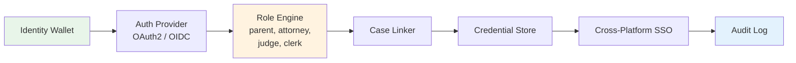

# 🪪 Universal Legal Identity Layer — Login Once, Access Everything

[](LICENSE)
[](https://www.typescriptlang.org/)
[](CONTRIBUTING.md)
[](https://github.com/dougdevitre/legal-identity-layer/pulls)

## The Problem

Justice tech is fragmented. Users create separate accounts for every system — court portals, legal aid platforms, document storage, notification services. There is no portability, no unified view, and no way to carry credentials across systems. Each new tool means another login, another profile, another place where case information lives in isolation.

## The Solution

**Legal Identity Layer** provides a secure identity wallet with case-linked credentials, role-based access, and cross-platform SSO. Think Stripe Identity for justice technology. One login unlocks the entire ecosystem — court filings, legal aid intake, evidence storage, and more — with appropriate role-based permissions at every layer.



## Who This Helps

- **Court IT departments** unifying authentication across legacy and modern systems
- **Legal aid networks** sharing client intake across partner organizations
- **Justice tech vendors** integrating seamlessly with the ecosystem
- **Users tired of multiple logins** who need a single, secure identity

## Features

- **Secure identity wallet** — portable user profile with encrypted storage
- **Case-linked credentials** — bind identity to specific court cases
- **Role-based access** — parent, attorney, judge, clerk, advocate, and custom roles
- **Cross-platform SSO** — one login across the entire Justice OS ecosystem
- **Credential verification** — validate attorney bar status, court appointments
- **Audit logging** — every auth event recorded for compliance and security

## Quick Start

```bash
npm install @justice-os/identity
```

```typescript
import { IdentityWallet, AuthProvider, RoleEngine } from '@justice-os/identity';

// Initialize the identity wallet
const wallet = new IdentityWallet({
  userId: 'user-123',
  displayName: 'Jane Doe',
});

// Set up authentication
const auth = new AuthProvider({
  issuer: 'https://auth.justiceos.org',
  clientId: 'court-portal',
});

// Check role-based access
const roles = new RoleEngine();
roles.assignRole('user-123', 'parent', { caseId: 'case-456' });

if (roles.hasPermission('user-123', 'view-case-documents', 'case-456')) {
  console.log('Access granted to case documents');
}
```

## Roadmap

| Phase | Feature | Status |
|-------|---------|--------|
| 1 | Identity wallet + credential store | 🔨 In Progress |
| 2 | OAuth2/OIDC auth provider | 📋 Planned |
| 3 | Role engine + permission matrix | 📋 Planned |
| 4 | Case linker | 📋 Planned |
| 5 | Cross-platform SSO | 📋 Planned |
| 6 | Audit logging + compliance reports | 📋 Planned |

## Project Structure

```
src/
├── index.ts
├── wallet/
│   ├── identity-wallet.ts     # IdentityWallet class
│   └── credential-store.ts    # CredentialStore class
├── auth/
│   ├── provider.ts            # AuthProvider — OAuth2/OIDC
│   ├── sso.ts                 # SSOManager — cross-platform
│   └── mfa.ts                 # MFAHandler
├── roles/
│   ├── role-engine.ts         # RoleEngine — assignment, checking, hierarchy
│   └── permissions.ts         # PermissionMatrix
├── cases/
│   └── case-linker.ts         # CaseLinker — link identity to cases
├── audit/
│   └── logger.ts              # AuditLogger — all auth events
└── types/
    └── index.ts
```

## Contributing

See [CONTRIBUTING.md](CONTRIBUTING.md) for guidelines.

## License

[MIT](LICENSE) — Built for the public good.

---

## Justice OS Ecosystem

This repository is part of the **Justice OS** open-source ecosystem — 32 interconnected projects building the infrastructure for accessible justice technology.

### Core System Layer
| Repository | Description |
|-----------|-------------|
| [justice-os](https://github.com/dougdevitre/justice-os) | Core modular platform — the foundation |
| [justice-api-gateway](https://github.com/dougdevitre/justice-api-gateway) | Interoperability layer for courts |
| [legal-identity-layer](https://github.com/dougdevitre/legal-identity-layer) | Universal legal identity and auth |
| [case-continuity-engine](https://github.com/dougdevitre/case-continuity-engine) | Never lose case history across systems |
| [offline-justice-sync](https://github.com/dougdevitre/offline-justice-sync) | Works without internet — local-first sync |

### User Experience Layer
| Repository | Description |
|-----------|-------------|
| [justice-navigator](https://github.com/dougdevitre/justice-navigator) | Google Maps for legal problems |
| [mobile-court-access](https://github.com/dougdevitre/mobile-court-access) | Mobile-first court access kit |
| [cognitive-load-ui](https://github.com/dougdevitre/cognitive-load-ui) | Design system for stressed users |
| [multilingual-justice](https://github.com/dougdevitre/multilingual-justice) | Real-time legal translation |
| [voice-legal-interface](https://github.com/dougdevitre/voice-legal-interface) | Justice without reading or typing |
| [legal-plain-language](https://github.com/dougdevitre/legal-plain-language) | Turn legalese into human language |

### AI + Intelligence Layer
| Repository | Description |
|-----------|-------------|
| [vetted-legal-ai](https://github.com/dougdevitre/vetted-legal-ai) | RAG engine with citation validation |
| [justice-knowledge-graph](https://github.com/dougdevitre/justice-knowledge-graph) | Open data layer for laws and procedures |
| [legal-ai-guardrails](https://github.com/dougdevitre/legal-ai-guardrails) | AI safety SDK for justice use |
| [emotional-intelligence-ai](https://github.com/dougdevitre/emotional-intelligence-ai) | Reduce conflict, improve outcomes |
| [ai-reasoning-engine](https://github.com/dougdevitre/ai-reasoning-engine) | Show your work for AI decisions |

### Infrastructure + Trust Layer
| Repository | Description |
|-----------|-------------|
| [evidence-vault](https://github.com/dougdevitre/evidence-vault) | Privacy-first secure evidence storage |
| [court-notification-engine](https://github.com/dougdevitre/court-notification-engine) | Smart deadline and hearing alerts |
| [justice-analytics](https://github.com/dougdevitre/justice-analytics) | Bias detection and disparity dashboards |
| [evidence-timeline](https://github.com/dougdevitre/evidence-timeline) | Evidence timeline builder |

### Tools + Automation Layer
| Repository | Description |
|-----------|-------------|
| [court-doc-engine](https://github.com/dougdevitre/court-doc-engine) | TurboTax for legal filings |
| [justice-workflow-engine](https://github.com/dougdevitre/justice-workflow-engine) | Zapier for legal processes |
| [pro-se-toolkit](https://github.com/dougdevitre/pro-se-toolkit) | Self-represented litigant tools |
| [justice-score-engine](https://github.com/dougdevitre/justice-score-engine) | Access-to-justice measurement |
| [justice-app-generator](https://github.com/dougdevitre/justice-app-generator) | No-code builder for justice tools |

### Quality + Testing Layer
| Repository | Description |
|-----------|-------------|
| [justice-persona-simulator](https://github.com/dougdevitre/justice-persona-simulator) | Test products against real human realities |
| [justice-experiment-lab](https://github.com/dougdevitre/justice-experiment-lab) | A/B testing for justice outcomes |

### Adoption Layer
| Repository | Description |
|-----------|-------------|
| [digital-literacy-sim](https://github.com/dougdevitre/digital-literacy-sim) | Digital literacy simulator |
| [legal-resource-discovery](https://github.com/dougdevitre/legal-resource-discovery) | Find the right help instantly |
| [court-simulation-sandbox](https://github.com/dougdevitre/court-simulation-sandbox) | Practice before the real thing |
| [justice-components](https://github.com/dougdevitre/justice-components) | Reusable component library |
| [justice-dev-starter-kit](https://github.com/dougdevitre/justice-dev-starter-kit) | Ultimate boilerplate for justice tech builders |

> Built with purpose. Open by design. Justice for all.


---

### ⚠️ Disclaimer

This project is provided for **informational and educational purposes only** and does **not** constitute legal advice, legal representation, or an attorney-client relationship. No warranty is made regarding accuracy, completeness, or fitness for any particular legal matter. **Always consult a licensed attorney** in your jurisdiction before making legal decisions. Use of this software does not create any professional-client relationship.

---

### Built by Doug Devitre

I build AI-powered platforms that solve real problems. I also speak about it.

**[CoTrackPro](https://cotrackpro.com)** · admin@cotrackpro.com

→ **Hire me:** AI platform development · Strategic consulting · Keynote speaking

> *AWS AI/Cloud/Dev Certified · UX Certified (NNg) · Certified Speaking Professional (NSA)*
> *Author of Screen to Screen Selling (McGraw Hill) · 100,000+ professionals trained*
