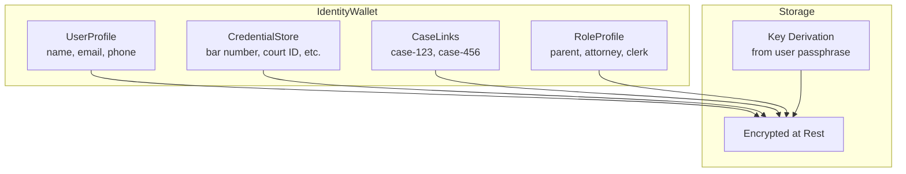
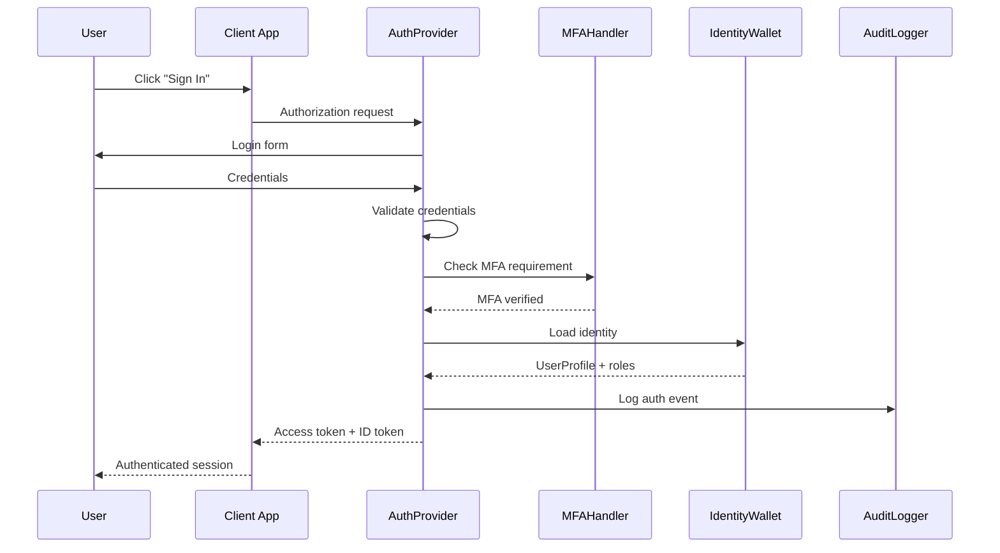
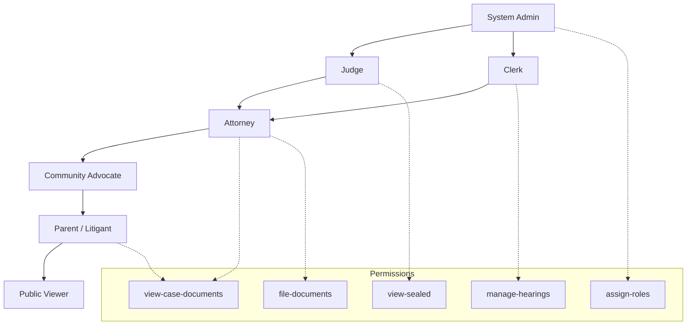
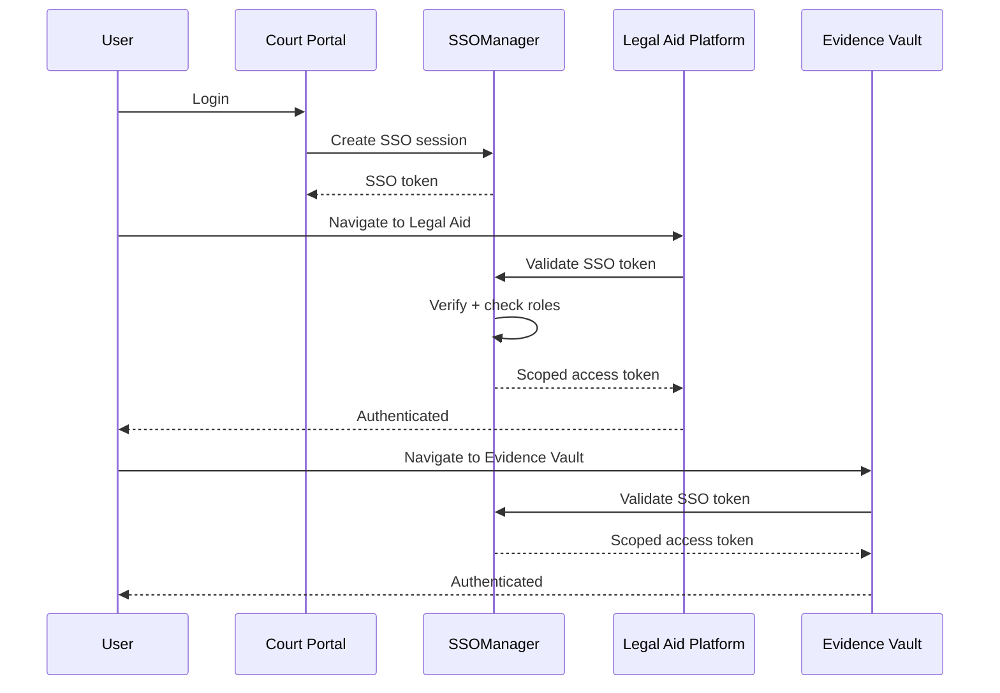

# Legal Identity Layer — Architecture

## Overview

The Legal Identity Layer provides a unified authentication and authorization system for the Justice OS ecosystem. It combines an identity wallet (portable user profile), an OAuth2/OIDC auth provider, a role-based access control engine, and case-linking capabilities — all backed by comprehensive audit logging.

---

## 1. Identity Wallet Model

The identity wallet is a portable, encrypted container for a user's legal identity, credentials, and case associations.

---

## 2. Authentication Flow

The auth provider implements standard OAuth2/OIDC flows with optional MFA, supporting both interactive and machine-to-machine authentication.

---

## 3. Role Hierarchy

Roles form a hierarchy where higher-privilege roles inherit permissions from lower ones. Each role can be scoped to a specific case.

---

## 4. Cross-Platform SSO Flow

SSO enables a single authentication event to grant access across all Justice OS applications, using federated token exchange.

---

## Data Flow Summary

1. **User creates identity** -> `IdentityWallet` stores encrypted profile + credentials
2. **User logs in** -> `AuthProvider` handles OAuth2/OIDC flow with optional MFA
3. **Role engine** -> assigns case-scoped roles and evaluates permissions
4. **Case linker** -> binds identity to specific court cases
5. **SSO manager** -> enables seamless cross-platform authentication
6. **Audit logger** -> records every auth event for compliance
