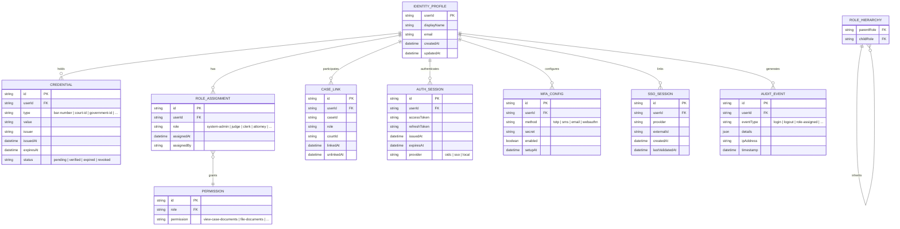

# Legal Identity Layer Data Model

## Entity Relationship Diagram

## Key Relationships

- An **Identity Profile** is the root entity representing a user in the justice system
- **Credentials** (bar numbers, court IDs) are stored in the user's wallet and independently verifiable
- **Role Assignments** connect users to system roles which grant **Permissions** via a hierarchy
- **Case Links** associate a user with specific court cases in a particular role
- **Auth Sessions** track active authentication state including OAuth/OIDC tokens
- **MFA Config** stores multi-factor authentication setup per user
- **SSO Sessions** link external identity provider sessions to internal profiles
- **Audit Events** provide a complete trail of all authentication and authorization actions
